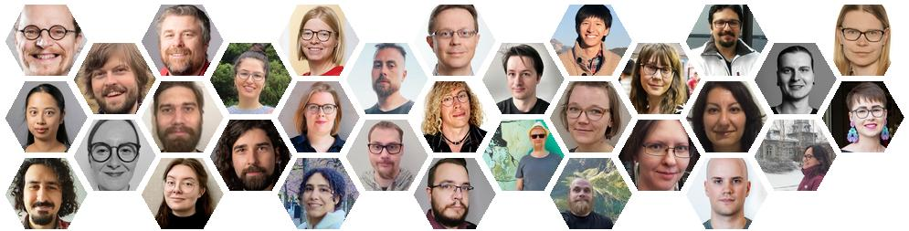

**The TurkuNLP Group** is a group of researchers at the University of Turku and the UTU graduate school (UTUGS). The group consists of approximately 30 dedicated researchers from research assistants to professors.

Our international and interdisciplinary group does research on various aspects of natural language processing / language technology and digital linguistics, ranging from corpus annotation and analysis to machine learning theory and applications.

**Our main research topics are**
* Syntactic and semantic analysis of Finnish
* Large Language Models for Finnish and other languages
* BioNLP: mining and modeling biological, biomedical, and clinical texts
* Modeling and analysis of registers and genres on the internet
* Linguistic analysis of language use on the internet

### Recent updates

For the latest updates, visit:

* [List of TurkuNLP publications](publications.html)
* [TurkuNLP github](https://github.com/turkunlp)
* [TurkuNLP on HuggingFace](https://huggingface.co/TurkuNLP)

