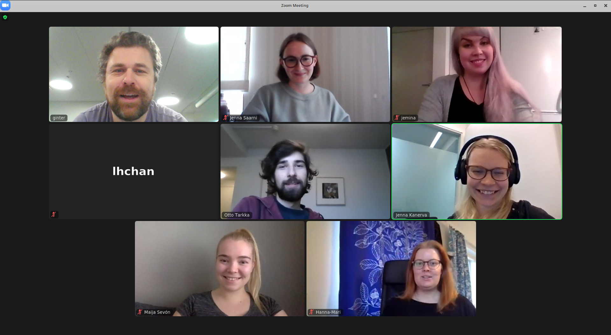

## Textual paraphrase dataset for deep language modeling
The project gathers a large dataset of Finnish and Swedish paraphrases. The paraphrases are selected and classified manually, so as to minimize lexical overlap, and provide examples that are maximally structurally and lexically different. The primary application for the dataset is the development and evaluation of deep language models, and representation learning in general. The project is funded by the European Language Grid and the project runtime is August 2020 - July 2021.

<a href="assets/files/paraphrase_poster.pdf">Project poster</a>

