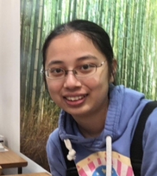
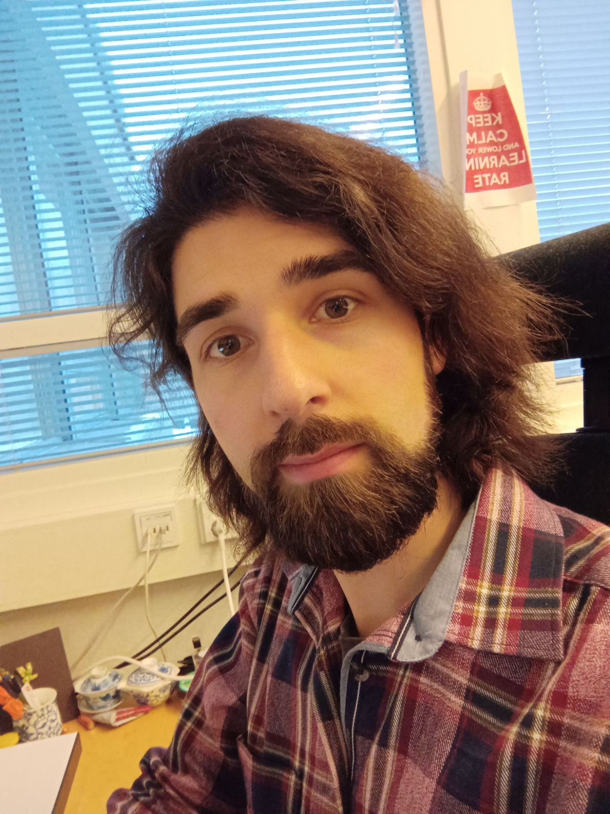
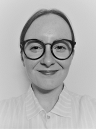
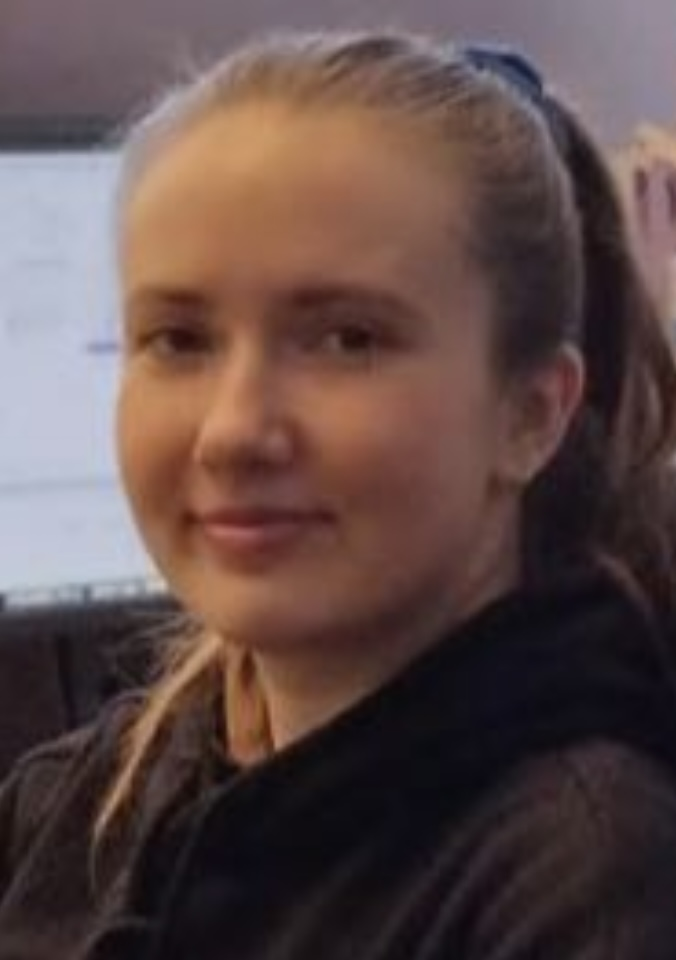

<section>    
    <header class="major">
        <h2>Professors</h2>
    </header>
    

        

            
            

		    	<h3><a href="https://www.utu.fi/en/people/tapio-salakoski">Tapio Salakoski</a></h3>
		    	
Professor

	    	

        

        

            
            

		    	<h3><a href="https://fginter.github.io/">Filip Ginter</a></h3>
		    	
Professor

	    	

        

        

            
            

		    	<h3><a href="https://www.utu.fi/en/people/veronika-laippla">Veronika Laippala</a></h3>
		    	
Professor

	    	

        

    	

    		
    		

				<h3><a href="https://www.utu.fi/en/people/sampo-pyysalo">Sampo Pyysalo</a></h3>
				
Sen. res. fellow

			

     	

   

</section>

<section>
   <header class="major">
      <h2>Postdoctoral researchers</h2>
   </header>
   

     

       
       

		   <h3><a href="https://www.utu.fi/en/people/farrokh-mehryary">Farrokh Mehryary</a></h3>
       

     

     

       
       

		   <h3><a href="https://github.com/jmnybl">Jenna Kanerva</a></h3>
       

     

     

       
       

		   <h3><a href="https://www.utu.fi/en/people/erik-henriksson">Erik Henriksson</a></h3>
       

     

   

</section>

<section>
    <header class="major">
        <h2>PhD Students and Research Assistants</h2>
    </header>
    

        

            
            

	    	<h3><a href="https://www.utu.fi/en/people/liina-repo">Liina Repo</a></h3>
      		
Liina's research interests focus on corpus linguistics, Early and Late Modern English language variation, and using computational methods to study register variation in large historical language databases.

      	    

        

        

            
            

	    	<h3><a href="https://www.utu.fi/en/people/ville-komulainen">Ville Komulainen</a></h3>
      	    

        

        

            
            

	    	<h3><a href="https://www.utu.fi/en/people/li-hsin-chang">Li-Hsin Chang</a></h3>
      	    

        

        

            
            

	    	<h3>Juhani Luotolahti</h3>
      	    

        

	

    

        

            
            

	    	<h3><a href="https://www.utu.fi/en/people/hanna-mari-kupari">Hanna-Mari Kupari</a></h3>
      		
Hanna-Mari Kupari's research combines medieval Latin textual data with latest machine learning methods. She holds a Master’s degree in Classical Philology with a specialization in medieval Latin. In her PhD she is focusing on grammar, improvement of parsing tools, structuring data and local history. Her work is funded by the Emil Aaltonen Foundation.

      	    

        

        

            
            

			<h3><a href="https://www.utu.fi/en/people/valtteri-skantsi">Valtteri Skantsi</a></h3>
   			

        

        

            
            

	    	<h3><a href="https://www.utu.fi/en/people/saara-hellstrom">Saara Hellström</a></h3>
      		
Saara Hellström is interested in register variation in online context. She focuses on web language use from a multilingual, cross-linguistic perspective using various machine learning and statistical methods. Currently, her main research focus is on French and Swedish web registers and hybrids.

      	    

        

        

            
            

				<h3><a href="https://www.utu.fi/en/people/risto-luukkonen">Risto Luukkonen</a></h3>
			

        

	

    

        

            
            

				<h3><a href="https://www.utu.fi/en/people/maryam-teimouribadelehdareh">Maryam Teimouri</a></h3>
			

        

        

            
            

	    	<h3><a href="https://www.utu.fi/en/people/selcen-erten-johansson">Selcen Erten-Johansson</a></h3>
      	    

        

        

            
            

	    	<h3><a href="https://www.utu.fi/en/people/otto-tarkka">Otto Tarkka</a></h3>
      		
Otto Tarkka's research focuses on analysing and improving text corpora with machine learning and Large Language Models.

      	    

        

        

            
            

	    	<h3><a href="https://www.utu.fi/en/people/akseli-reunamo">Akseli Reunamo</a></h3>
      		
Akseli Reunamo does research in Clinical NLP and long-context modeling.

      	    

        

    

    

        

            
            

				<h3><a href="https://www.utu.fi/en/people/jouni-luoma">Jouni Luoma</a></h3>
			

        

        

            
            

			<h3><a href="https://www.utu.fi/en/people/jenna-saarni">Jenna Saarni</a></h3>
   			

        

        

            
            

	    	<h3><a href="https://www.utu.fi/en/people/frederike-schram">Frederike Schram</a></h3>
      		
Frederike Schram has a background in sociolinguistics and her research interests include regional or minority languages, digital discourse, commodification of language, and language and identity, focusing on the use of Low German in digital spaces.

      	    

        

        

            
            

				<h3><a href="https://www.utu.fi/en/people/cassandra-ledins">Cassandra Ledins</a></h3>
			

        

    

</section>

