

<section>    
    <header class="major">
        <h2>Professors and Research Fellows</h2>
    </header>
    

        

            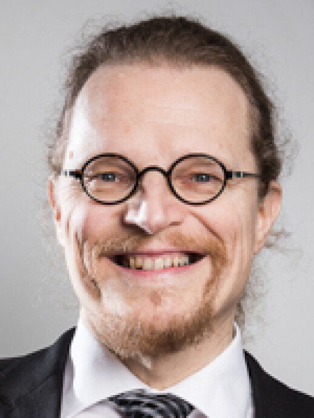
            

				<h3><a href="https://www.utu.fi/en/people/tapio-salakoski">Tapio Salakoski</a></h3>
				<h4>Professor</h4>
	    	

        

        

            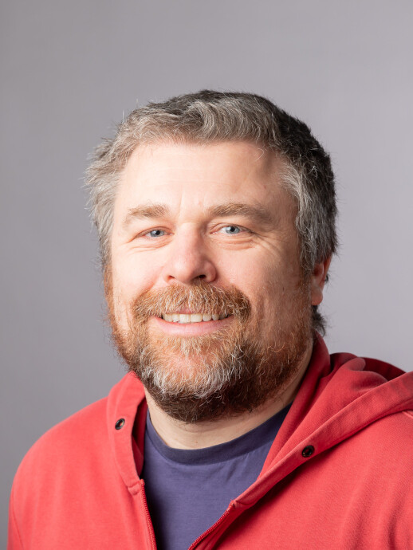
            

				<h3><a href="https://fginter.github.io/">Filip Ginter</a></h3>
				<h4>Professor</h4>
	    	

        

        

            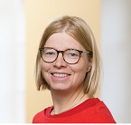
            

				<h3><a href="https://www.utu.fi/en/people/veronika-laippala">Veronika Laippala</a></h3>
				<h4>Professor</h4>
	    	

        

    	

    	    
    	    

				<h3><a href="https://www.utu.fi/en/people/sampo-pyysalo">Sampo Pyysalo</a></h3>
				<h4>Sen. res. fellow</h4>
	    	

     	

	
 
	

		

    	    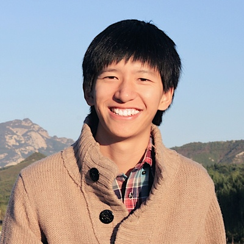
    	    

		        <h3><a href="https://www.utu.fi/en/people/shaoxiong-ji">Shaoxiong Ji</a></h3>
		        <h4>Asst. Professor</h4>
				
PI at ELLIS Institute Finland. His research directions include multilingual natural language processing and AI for health.

	        

		
 
        
 

		
 

		
 

  	
 
</section>

<section>
	<header class="major">
		<h2>Postdoctoral Researchers</h2>
	</header>
	

		

			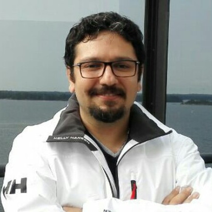
			

				<h3><a href="https://www.utu.fi/en/people/farrokh-mehryary">Farrokh Mehryary</a></h3>
				<h4>Postdoc</h4>
			

		

		

	       	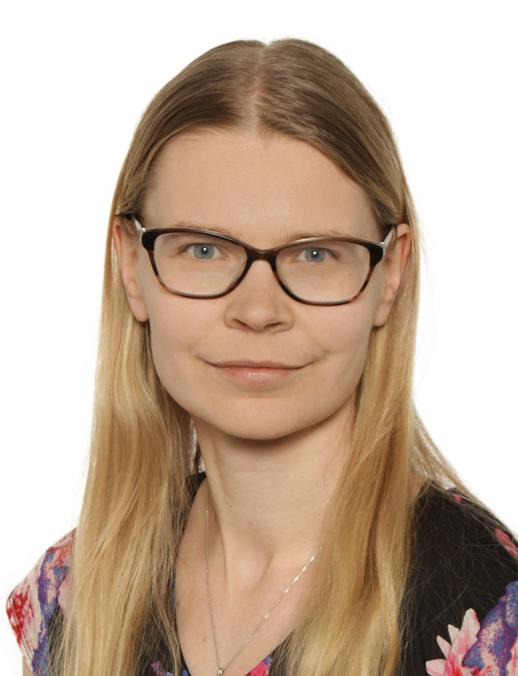
	       	

				<h3><a href="https://github.com/jmnybl">Jenna Kanerva</a></h3>
				<h4>University Lecturer</h4>
			

		

		

			
			

				<h3><a href="https://www.utu.fi/en/people/erik-henriksson">Erik Henriksson</a></h3>
				<h4>Postdoc</h4>
			

		

		

	        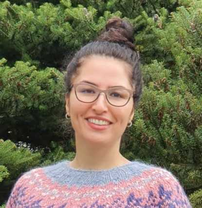
	        

				<h3><a href="https://www.utu.fi/en/people/laleh-davoodi">Laleh Davoodi</a></h3>
			    <h4>Postdoc</h4>
			

	    

	

	

		

			
			

				<h3><a href="https://www.utu.fi/en/people/fedor-vitiugin">Fedor Vitiugin</a></h3>
			   	<h4>Postdoc</h4>
			

		

		

			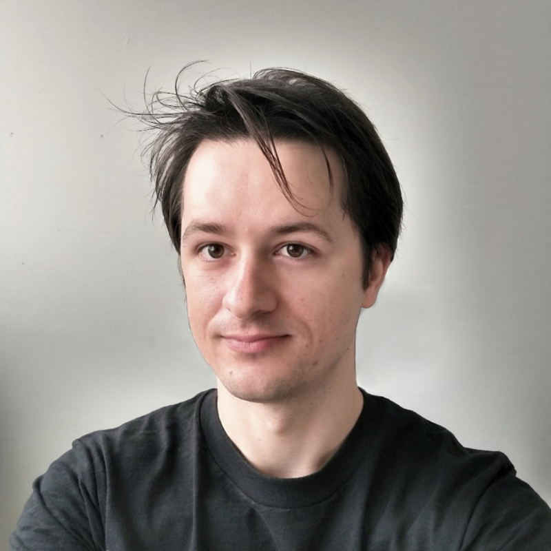
			

				<h3><a href="https://www.utu.fi/en/people/tomasz-galica">Tomasz Galica</a></h3>
			   	<h4>Postdoc</h4>
			

		

		

			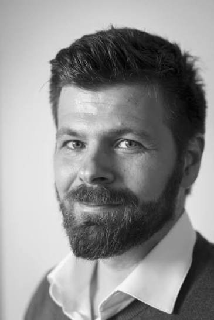
			

				<h3><a href="https://research.utu.fi/converis/portal/detail/Person/393437417">Antti Kanner</a></h3>
			   	<h4>Postdoc</h4>
			

		

		

		

		

		

	

</section>

<section>
    <header class="major">
        <h2>Doctoral Researchers, Project Researchers and Research Assistants</h2>
    </header>
    

        

            
            

	    		<h3><a href="https://www.utu.fi/en/people/liina-repo">Liina Repo</a></h3>
				<h4>Doctoral researcher</h4>
      			
Liina's research interests focus on corpus linguistics, Early and Late Modern English language variation, and using computational methods to study register variation in large historical language databases.

      	    

        

		

            
            

	    		<h3><a href="https://www.utu.fi/en/people/akseli-reunamo">Akseli Reunamo</a></h3>
				<h4>Doctoral researcher</h4>
      			
Akseli does research in clinical NLP and long-context modeling.

      	    

		

        

            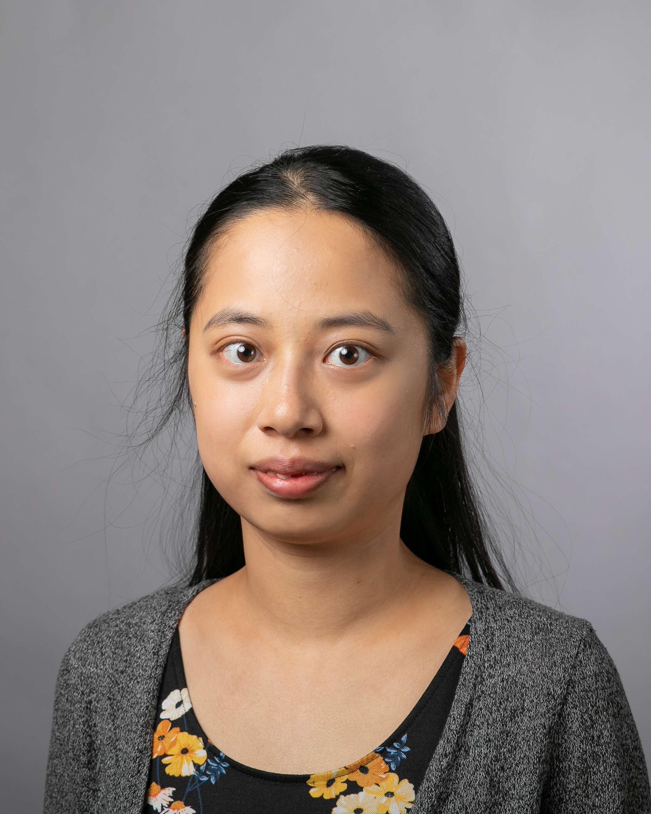
            

	    		<h3><a href="https://www.utu.fi/en/people/li-hsin-chang">Li-Hsin Chang</a></h3>
				<h4>Doctoral researcher</h4>
		    	
Li-Hsin does research in educational NLP, specializing in computer-assisted grading of student responses.

      	    

        

        

            
            

	    		<h3>Juhani Luotolahti</h3>
				<h4>Doctoral researcher</h4>
      	    

        

	

    

        

            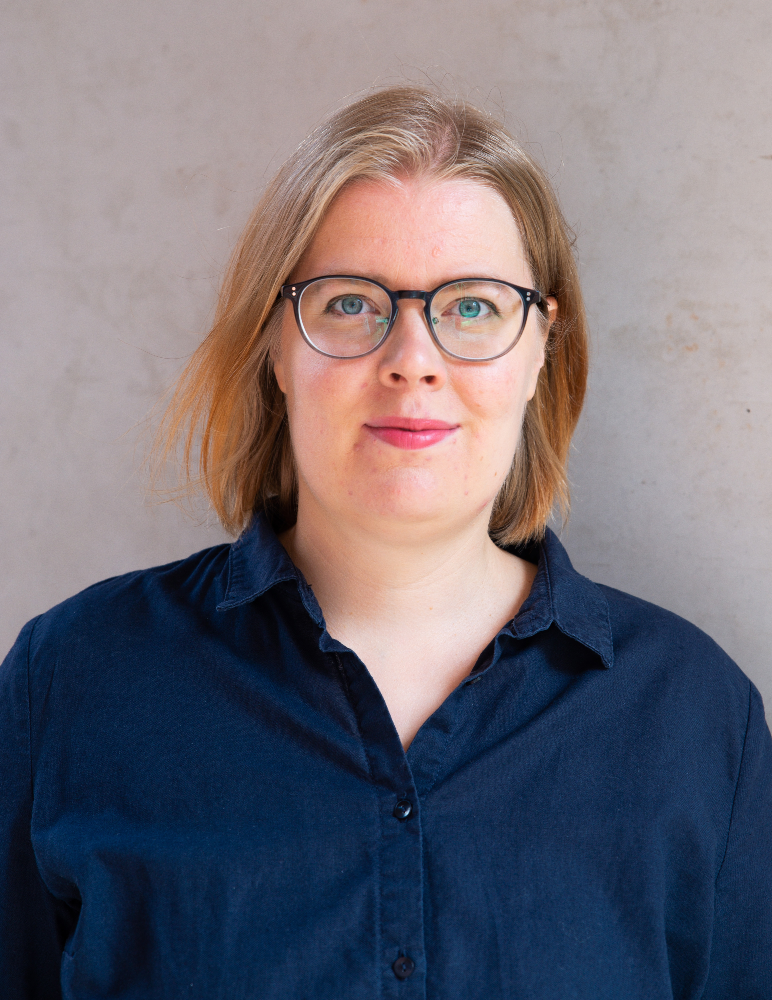
            

	    		<h3><a href="https://www.utu.fi/en/people/hanna-mari-kupari">Hanna-Mari Kupari</a></h3>
				<h4>Doctoral researcher</h4>
      			
Hanna-Mari's research combines medieval Latin textual data with latest machine learning methods. She holds a Master’s degree in Classical Philology with a specialization in medieval Latin. In her PhD she is focusing on grammar, improvement of parsing tools, structuring data and local history. Her work is funded by the Emil Aaltonen Foundation.

      	    

        

        

            
            

				<h3><a href="https://www.utu.fi/en/people/valtteri-skantsi">Valtteri Skantsi</a></h3>
				<h4>Doctoral researcher</h4>
   			

        

        

            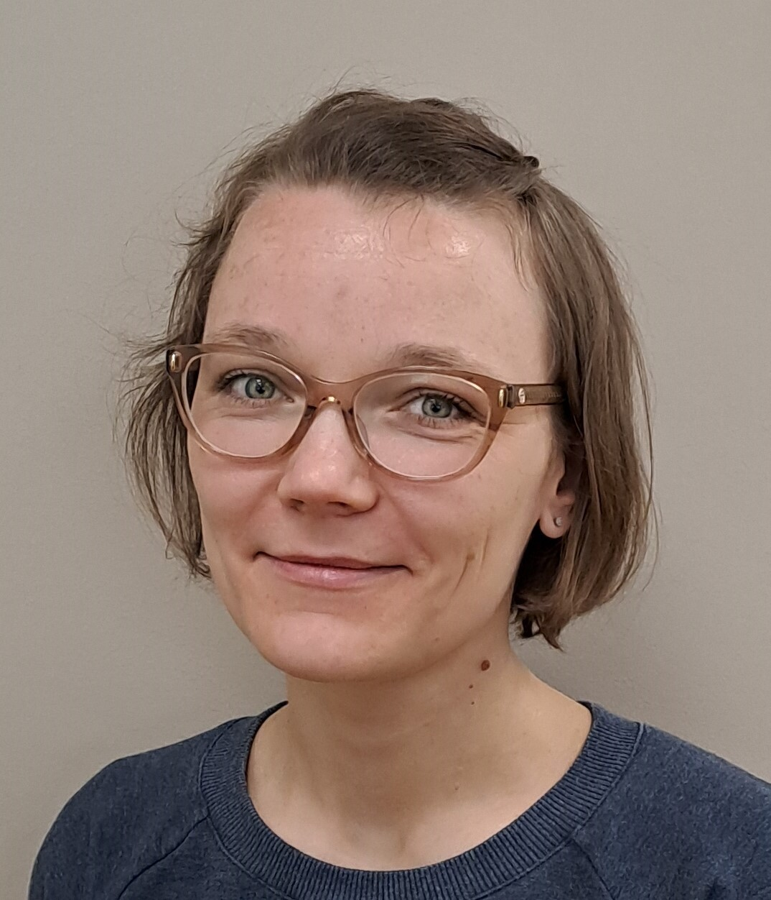
            

	    		<h3><a href="https://www.utu.fi/en/people/saara-hellstrom">Saara Hellström</a></h3>
				<h4>Doctoral researcher</h4>
      			
Saara is interested in register variation in online context. She focuses on web language use from a multilingual, cross-linguistic perspective using various machine learning and statistical methods. Currently, her main research focus is on French and Swedish web registers and hybrids.

      	    

        

        

            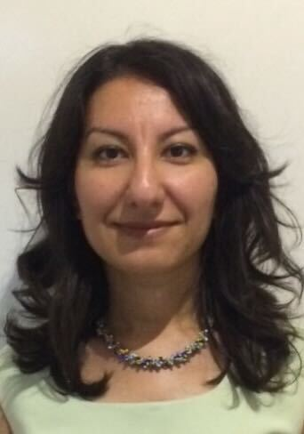
            

	    		<h3><a href="https://www.utu.fi/en/people/selcen-erten-johansson">Selcen Erten Johansson</a></h3>
				<h4>Doctoral researcher</h4>
		    	
Selcen conducts research in corpus linguistics with a focus on text varieties (registers) and media discourse analysis on the Turkish web.

      	    

        

	

    

        

            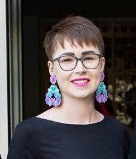
            

	    		<h3><a href="https://www.utu.fi/en/people/frederike-schram">Frederike Schram</a></h3>
				<h4>Doctoral researcher</h4>
      			
Frederike's research interests include regional or minority languages, digital discourse, commodification of language, and language and identity, focusing on the use of Low German in digital spaces.

      	    

        

        

            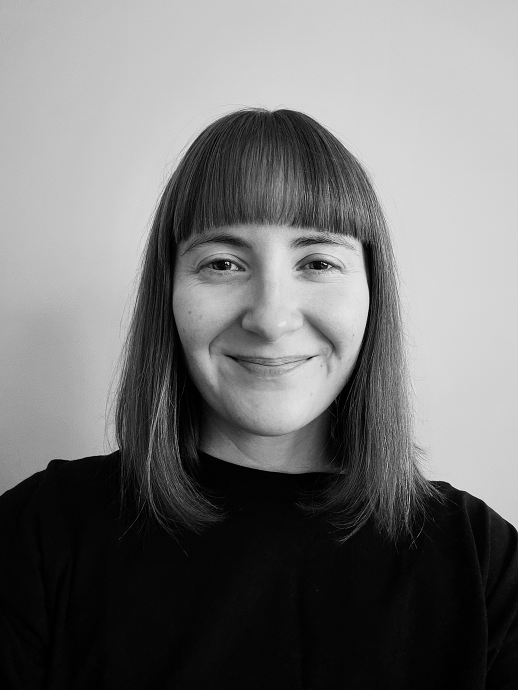
            

				<h3><a href="https://www.utu.fi/en/people/jenna-saarni">Jenna Saarni</a></h3>
				<h4>Doctoral researcher</h4>
				
Jenna's research focuses on evaluative language in digital media during the Covid-19 pandemic.

   			

        

        

            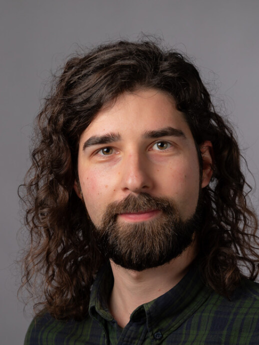
            

	    		<h3><a href="https://www.utu.fi/en/people/otto-tarkka">Otto Tarkka</a></h3>
				<h4>Doctoral researcher</h4>
      			
Otto's research focuses on analysing and improving text corpora with machine learning and LLMs.

      	    

        

        

            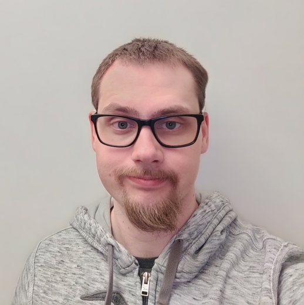
            

				<h3><a href="https://www.utu.fi/en/people/tapio-nojonen">Tapio Nojonen</a></h3>
		    	<h4>Doctoral researcher</h4>
		    	
Tapio's research is on using modern NLP methods to create and detect suitable Finnish reading comprehension material for students in primary and lower secondary education.

	    	

        

    

    

        

            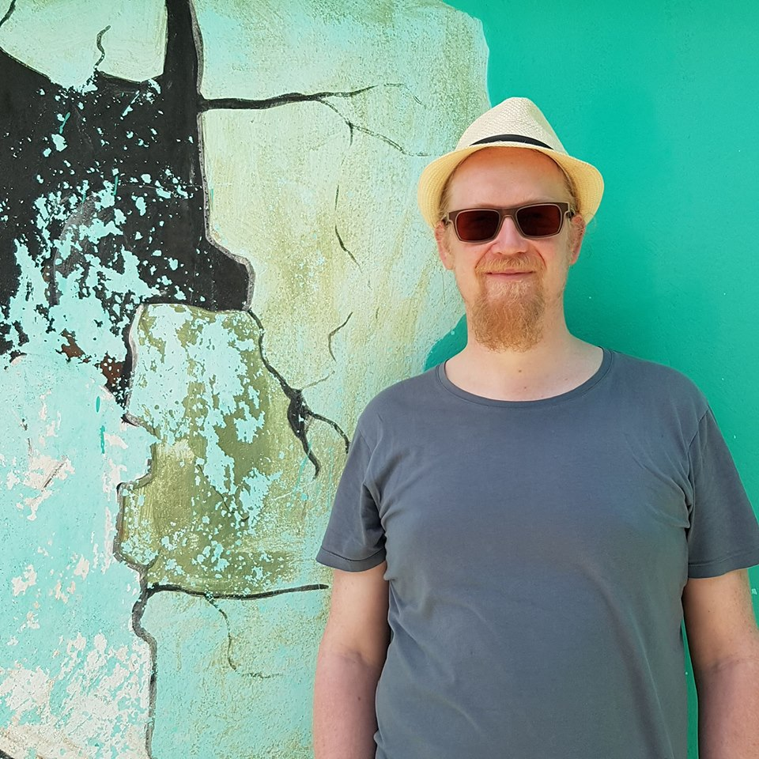
            

				<h3><a href="https://www.utu.fi/en/people/jouni-luoma">Jouni Luoma</a></h3>
				<h4>Doctoral researcher</h4>
			

        

        

            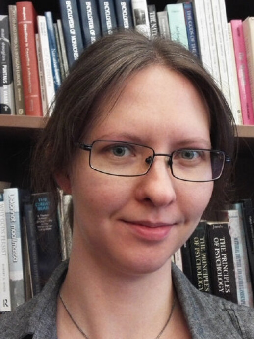
            

				<h3><a href="https://www.utu.fi/en/people/anna-ristila">Anna Ristilä</a></h3>
		    	<h4>Doctoral researcher</h4>
				
Anna's dissertation explores the topic landscape of Finnish parliamentary speeches.

			

        

		

			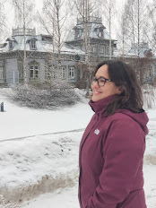
            

				<h3><a href="https://www.utu.fi/en/people/erofili-psaltaki">Erofili Psaltaki</a></h3>
				<h4>Doctoral Researcher</h4>
				
My research combines dialectology and language variation with NLP, and I build tools to make sense of dialectal corpora.

	    	

		

		

			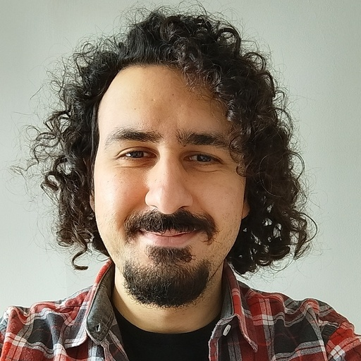
            

				<h3><a href="https://www.utu.fi/en/people/alireza-razzaghi">Alireza Razzaghi</a></h3>
		    	<h4>Doctoral Researcher</h4>
				
I am doing research on Persian registers in web corpora. I am interested in automatic text analysis and applying AI-based systems to linguistic corpora.

	    	

		

    

    

      

        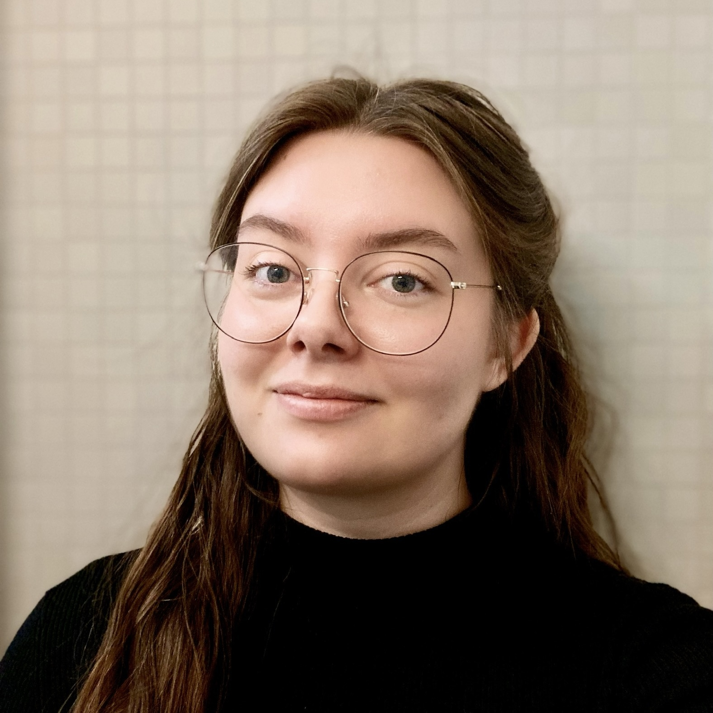
        

	  <h3><a href="https://www.utu.fi/en/people/amanda-myntti">Amanda Myntti</a></h3>
	  <h4>Doctoral Researcher</h4>
	

      

      

        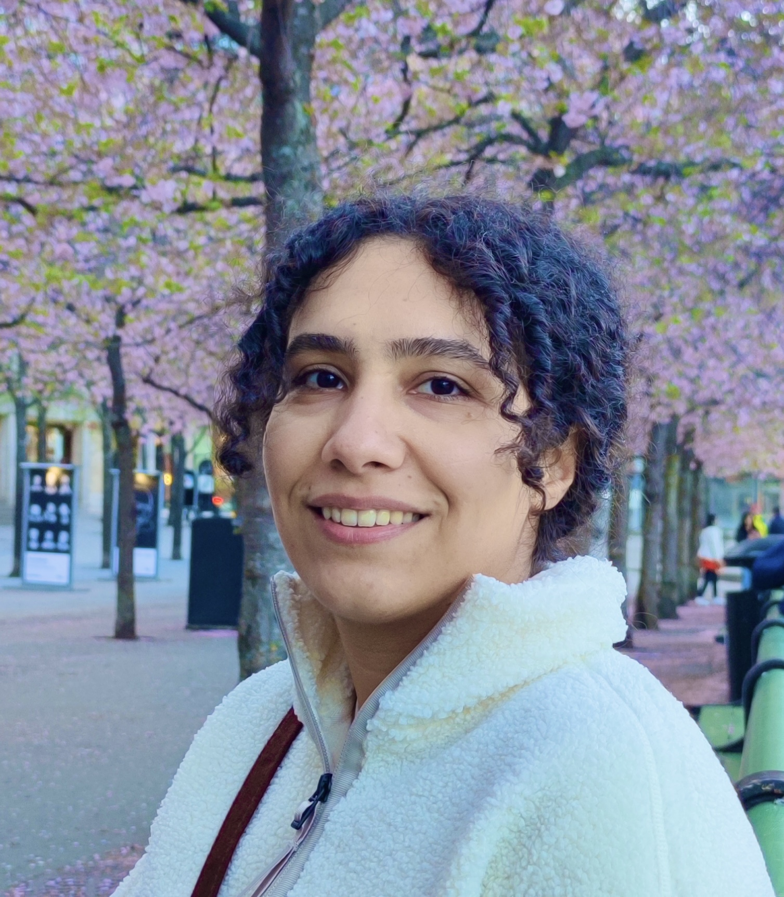
        

	  <h3><a href="https://www.utu.fi/en/people/maryam-teimouribadelehdareh">Maryam Teimouri</a></h3>
	  <h4>Project researcher</h4>
	

      

      

        
        

	  <h3><a href="https://www.utu.fi/en/people/ville-komulainen">Ville Komulainen</a></h3>
	  <h4>Research assistant</h4>
      	

      

      

        
        

	  <h3><a href="https://www.utu.fi/en/people/renhao-pei">Renhao Pei</a></h3>
	  <h4>Doctoral researcher</h4>
      	

      

    
 <!-- end of row -->

    

      

	
	

	  <h3><a href="https://www.utu.fi/en/people/dorian-beli">Dorian Beli</a></h3>
	  <h4>Doctoral Researcher</h4>
	

      

      
 

      
 

      
 

    
 <!-- end of row -->

</section>

